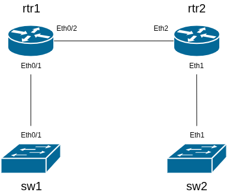

# Automating Network Configuration Management with Ansible !!!DRAFT!!!
## Introduction

This project demonstrates an example of automating network configuration management using Ansible for multi-vendor (Cisco & Arista) network devices. 
It showcases Configuration as Code (CaC) approach with Source of Truth (SoT) defined in Github where network configurations are defined in YAML files and deployed using Ansible playbooks. Two different configuration methods are presented here:
- declarative configuration with Ansible Network Resource modules
- template-based configuration with Ansible Config modules 

## Network Topology

The lab environment consists of:
- **rtr1**: Cisco IOS-XE Router (172.20.0.100)
- **sw1**: Cisco IOS-XE Switch (172.20.0.101) 
- **rtr2**: Arista EOS Router (172.20.0.102)
- **sw2**: Arista EOS Switch (172.20.0.103)

## Configuration Approaches

### 1. Config Module (Template-based)

This approach uses Jinja2 templates to generate device configurations from YAML data structures.

**Features:**
- Template-based configuration generation
- Full control over configuration syntax
- Supports complex configuration scenarios
- Platform-specific templates

### 2. Resource Module (Declarative)

This approach uses Ansible's network resource modules for declarative configuration management.

**Features:**
- Declarative configuration management
- Idempotent operations
- State management (merged, replaced, deleted)
- Vendor-agnostic data structures

